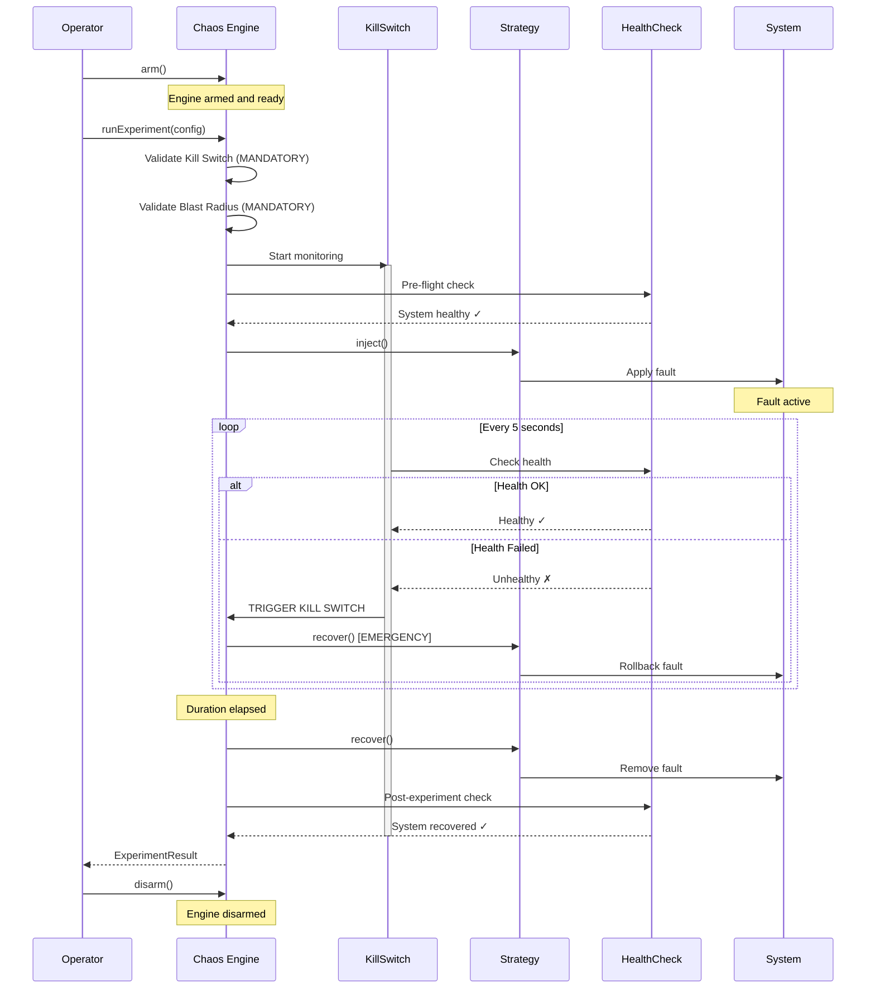
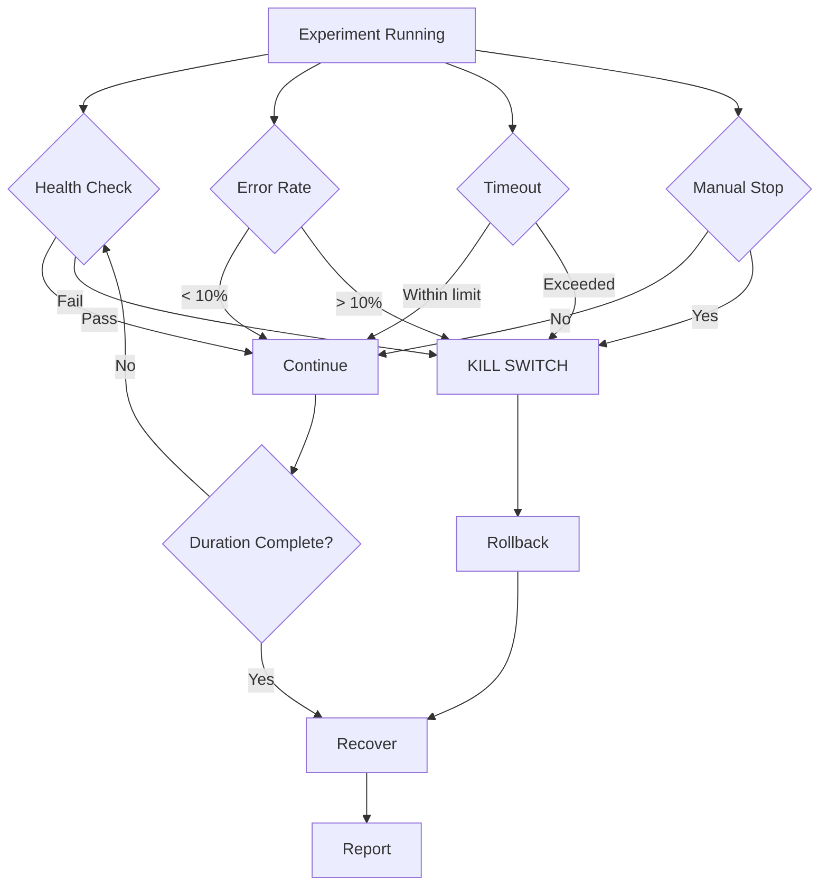
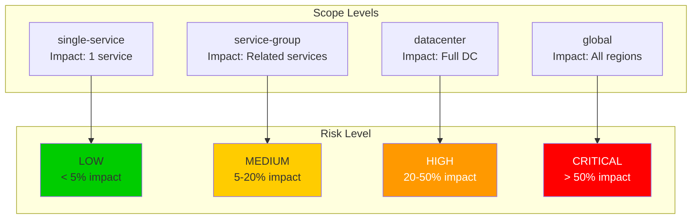

# Chaos Experiment Lifecycle

## Complete Lifecycle Diagram



## Kill Switch Triggers



## Blast Radius Levels



## Usage Example

```typescript
import { FaultInjectionEngine } from './chaos/engine';
import { NetworkLatencyStrategy } from './chaos/strategies';

const engine = new FaultInjectionEngine();

// 1. ARM the engine
engine.arm();

// 2. RUN experiment
const result = await engine.runExperiment({
  name: 'api-latency-test',
  strategy: new NetworkLatencyStrategy({ latencyMs: 500 }),
  duration: 30000,  // 30 seconds
  
  // MANDATORY: Kill Switch
  killSwitch: {
    enabled: true,
    triggers: ['health_check_fail', 'error_rate_threshold'],
    action: 'rollback',
    errorRateThreshold: 0.1
  },
  
  // MANDATORY: Blast Radius
  blastRadius: {
    scope: 'single-service',
    affectedServices: ['api-gateway'],
    estimatedImpactPercent: 5,
    maxDurationMs: 60000,
    rollbackTimeMs: 5000
  }
});

// 3. DISARM after completion
engine.disarm();

console.log(result.success);
console.log(result.healthCheck);
```
