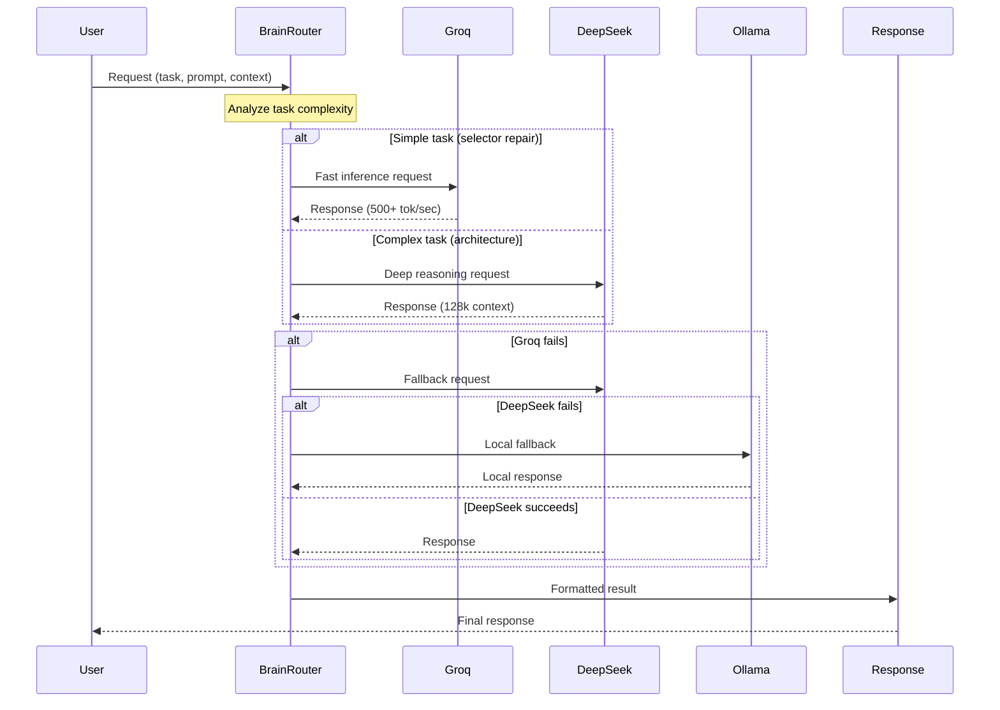
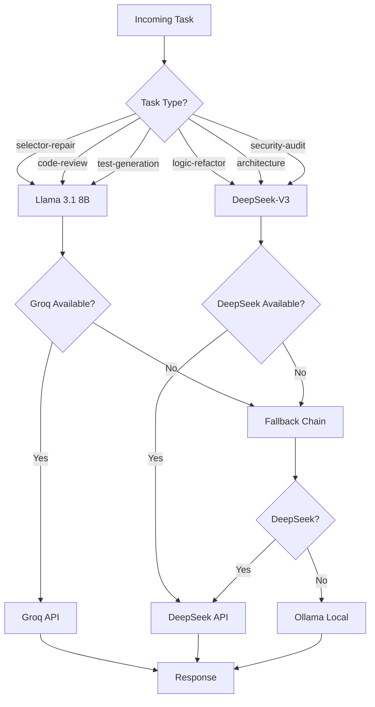
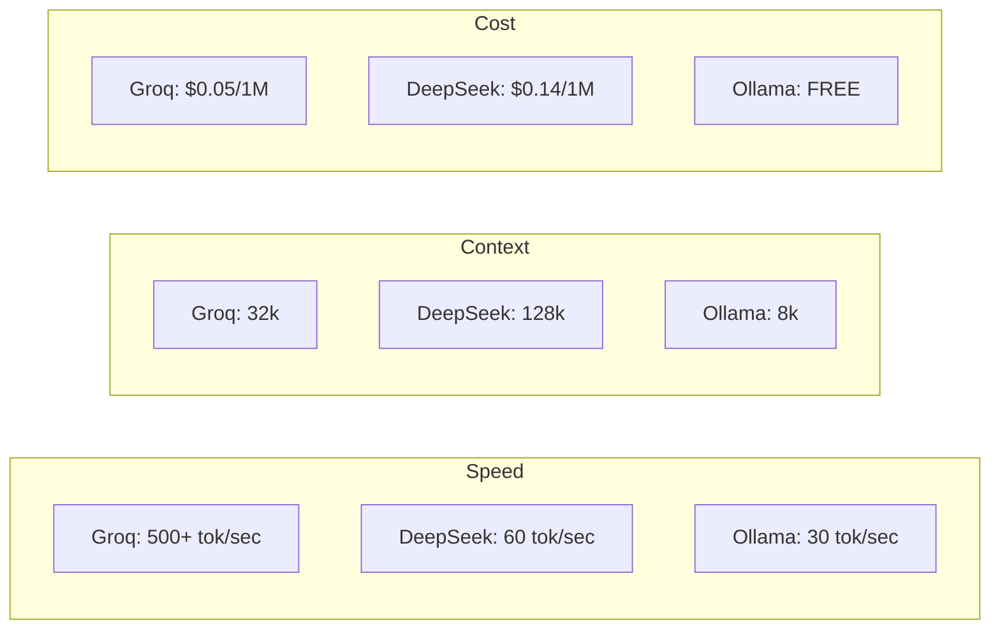

# Inference Flow Diagram

## Triple Hybrid Inference Architecture



## Model Selection Logic



## Provider Comparison



## Usage Example

```typescript
import { getNeuralInference } from './physics/NeuralInference';

const neural = getNeuralInference();

// Automatic provider selection based on availability
const response = await neural.infer({
  task: 'code-generation',
  prompt: 'Generate a Playwright test for login',
  context: {
    framework: 'playwright',
    language: 'typescript'
  }
});

console.log(response.content);
console.log(response.provider);  // 'groq' | 'deepseek' | 'ollama'
console.log(response.tokensUsed);
```
