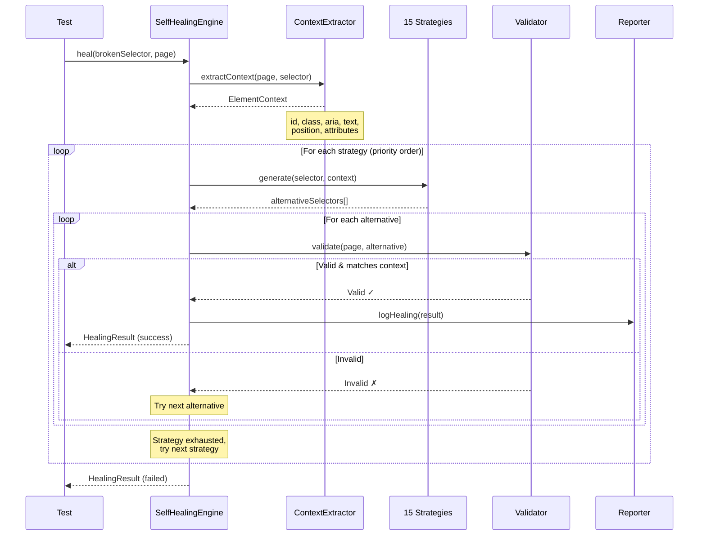
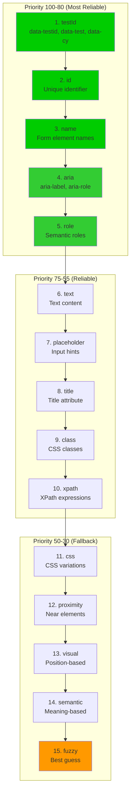
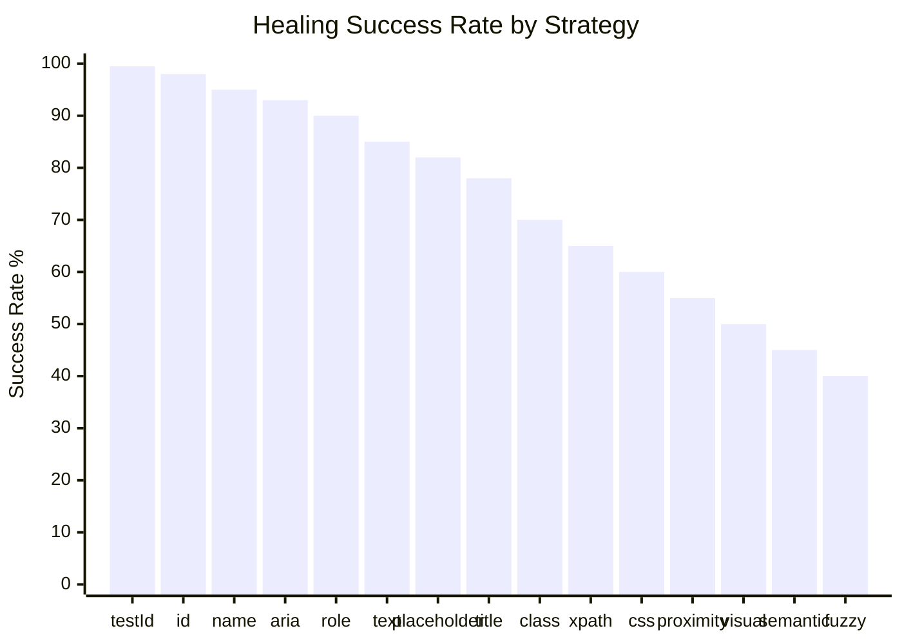
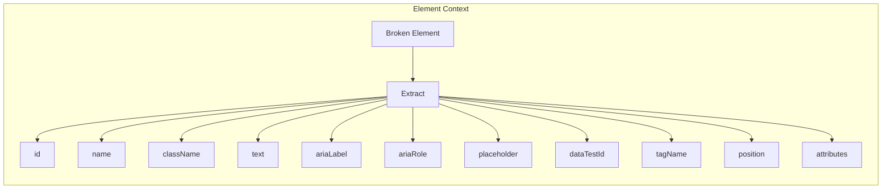

# Self-Healing Process

## Complete Healing Flow



## Strategy Priority Pyramid



## Success Rate by Strategy



## Context Extraction



## Usage Example

```typescript
import { SelfHealingEngine } from './healing/SelfHealingEngine';

const engine = new SelfHealingEngine({
  maxAttempts: 15,
  timeout: 30000,
  strategies: [
    'testId', 'id', 'name', 'aria', 'role', 'text',
    'placeholder', 'title', 'class', 'xpath', 'css',
    'proximity', 'visual', 'semantic', 'fuzzy'
  ],
  learnFromSuccess: true
});

// Set the page
engine.setPage(page);

// Heal a broken selector
const result = await engine.heal('#old-button-id');

if (result.success) {
  console.log('Healed selector:', result.healedSelector);
  console.log('Strategy used:', result.strategyUsed);
  console.log('Attempts:', result.attempts);
} else {
  console.log('Healing failed after', result.attempts, 'attempts');
}

// Get healing statistics
const stats = engine.getStatistics();
console.log('Total healings:', stats.totalHealings);
console.log('Success rate:', stats.successRate);
console.log('Top strategy:', stats.topStrategies[0].name);
```

## Healing Report Output

```json
{
  "generated": "2026-01-01T12:00:00Z",
  "summary": {
    "totalHealings": 150,
    "uniqueSelectors": 45,
    "topStrategies": [
      { "strategy": "testId", "count": 67, "percentage": 45 },
      { "strategy": "id", "count": 38, "percentage": 25 },
      { "strategy": "aria", "count": 22, "percentage": 15 }
    ],
    "avgAttemptsPerHealing": 2.3,
    "totalTimeSaved": "75 hours"
  }
}
```
